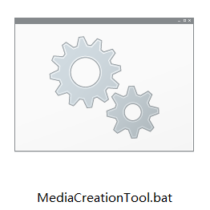
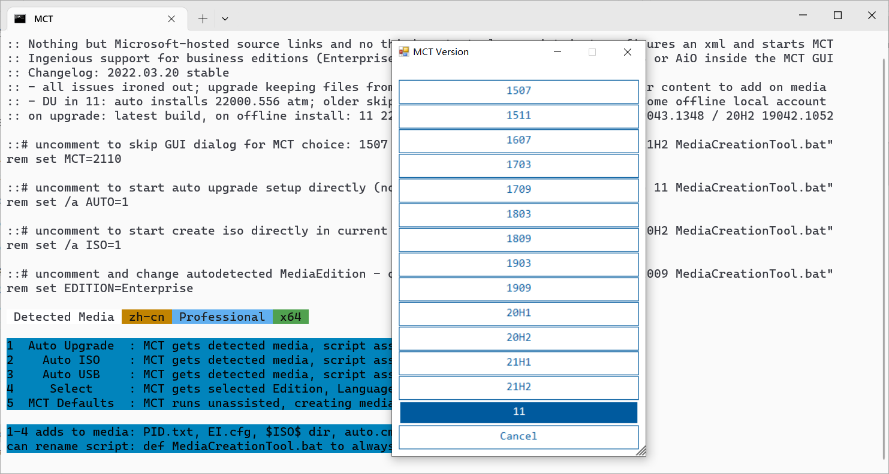
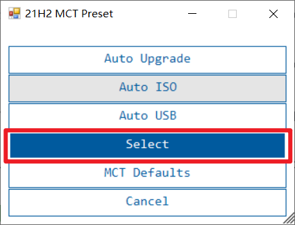
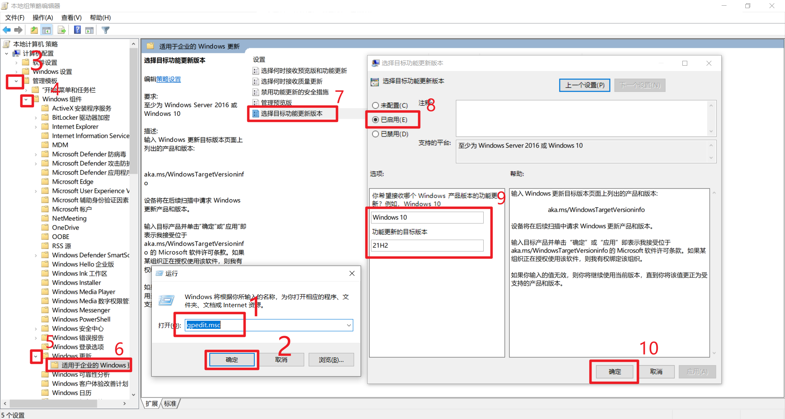

# PC服务队维修指南

- [PC服务队维修指南](#pc服务队维修指南)
  - [常用操作](#常用操作)
    - [显示系统级隐藏文件](#显示系统级隐藏文件)
    - [扫描系统文件的错误](#扫描系统文件的错误)
  - [疑难杂症](#疑难杂症)
    - [桌面图标变黑](#桌面图标变黑)
  - [重装系统](#重装系统)
    - [通过官方救援系统重置](#通过官方救援系统重置)
      - [联想](#联想)
        - [方式一](#方式一)
        - [方式二](#方式二)
      - [华为/荣耀](#华为荣耀)
      - [DELL（戴尔）](#dell戴尔)
      - [华硕](#华硕)
        - [方式一：救援系统](#方式一救援系统)
        - [方式二：BIOS云端恢复](#方式二bios云端恢复)
      - [acer（宏碁）](#acer宏碁)
    - [使用PE环境重装](#使用pe环境重装)
    - [通过Windows 恢复环境 (Windows RE)重置](#通过windows-恢复环境-windows-re重置)
  - [Windows更新相关](#windows更新相关)
    - [无损降级系统](#无损降级系统)
    - [指定Windows更新策略](#指定windows更新策略)
  - [附录](#附录)
    - [各种品牌的主板和笔记本的快捷启动按键](#各种品牌的主板和笔记本的快捷启动按键)
    - [长期支持版本(LTSC)](#长期支持版本ltsc)
      - [Windows 11](#windows-11)
      - [Windows 10](#windows-10)


## 常用操作

### <span id="show-hidden-files">显示系统级隐藏文件</span>

1. 从任务栏中打开**文件资源管理器**。 

2. 选择“**查看**”>“**选项**”>“**更改文件夹和搜索选项**”。

3. 选择“**查看**”选项卡，取消勾选“**隐藏受保护的操作系统文件**“，然后选择“**确定**”。

> 注意：请在完成相应操作后，重新勾选“**隐藏受保护的操作系统文件**“，以防误删系统文件。


### <span id="use-checker-to-repair-system-files">扫描系统文件的错误</span>

使用`CMD`或`Windows PowerShell`运行如下命令

```powershell
sfc /scannow
```

> 更多信息，参阅[使用系统文件检查器工具修复丢失或损坏的系统文件](https://support.microsoft.com/zh-cn/topic/使用系统文件检查器工具修复丢失或损坏的系统文件-79aa86cb-ca52-166a-92a3-966e85d4094e)


## 疑难杂症

### 桌面图标变黑

可能原因：图标缓存错误

解决方案：打开`C:\用户\当前用户名\Local\AppData`，将`IconCache.db`删除


> 如果无法找到AppData，请参阅[显示系统级隐藏文件](#show-hidden-files)
> 
> 如果仍无法修复，请参阅[扫描系统文件的错误](#use-checker-to-repair-system-files)


## 重装系统

### 通过官方救援系统重置

使用官方救援系统是重置系统最便捷、最快的方式，因其自带原厂驱动及软件，不需要联网安装，通常在20-30分钟即可回到桌面并正常使用。且如今电脑的部分功能需要依赖原厂软件实现，如华为的一碰传功能，故推荐使用该方式重置系统。

#### 联想

##### 方式一

适用机型：部分2017年后购买的预装Win11/10的机型

进入方式：

1. 关机状态下，使用卡针按下电脑侧面^*^的`Novo`键，电脑将自动开机。

   

   *部分电脑的`Novo`键在散热口旁边，如下图所示：

   

2. 在菜单中选择**System Recovery**

3. 如果系统直接进入高级启动页面，请参阅[通过Windows 恢复环境 (Windows RE)重置](#WinRE)


##### 方式二

适用机型：ThinkPad

进入方式：启动时使用`Fn+F11`组合键或`F11`键进入。（如果键盘上有`ThinkVantage`键，则可使用该键进入）


#### 华为/荣耀

适用机型：除MateBook 一代（Hertz）均支持

进入方式：启动时使用`Fn+F10`组合键或`F10`键进入


#### DELL（戴尔）

适用机型：硬盘含有隐藏救援分区的机型（通常在几G～十几G）

进入方式：开机按 `F12` 访问一次性启动菜单。适用键盘方向键选择 **SupportAssist OS Recovery**，然后按 `Enter` 键。 

> 提醒：必须在系统 BIOS 中启用 **SupportAssist OS Recovery**。

> 提示：如果系统中没有**SupportAssist OS Recovery**，还可以使用官方恢复工具：https://www.dell.com/support/osrecovery
>


#### 华硕

##### 方式一：救援系统

适用机型：步骤二中含有**MyASUS in WinRE**选项的机型

进入方式：

1. 步骤一：
   a. 能正常进入桌面：设置-更新和安全-恢复-高级启动-立即重启
   b. 不能正常进入桌面：开机时按`F9` 或 `F12` ，进入高级启动页面

2. 步骤二：


​		疑难解答-**MyASUS in WinRE**（部分机型可能跳过高级启动，直接进入MyASUS in WinRE）

https://www.asus.com.cn/support/FAQ/1041621/#A4

##### 方式二：BIOS云端恢复

适用机型：

- 支持英特尔第十二代 12 th Gen Intel® Core™处理器(Alder lake)或更高版本（部分机型不支持云端还原功能）
- 支持AMD的锐龙 6000 处理器(Rembrandt)或更高版本（部分机型不支持云端还原功能）

进入方式：开机时按键盘上的 `ESC` 或 `F2` 键，会出现以下画面。按键盘上的箭头键，选择 **Enter Setup**，然后按键盘上的`Enter`键进入**MyASUS in UEFI BIOS**


#### acer（宏碁）

适用机型：硬盘含有隐藏救援分区的机型（通常在几G～十几G）

进入方式：

1. 开机按`F2`键进入BIOS界面，先选择**MAIN**选项，把**D2D Recovery**的选项设置为**Enabled**。按`F10`保存退出。
1. 开机时按住`Alt`键不放，快速按`F10`。
1. 如出现**Acer eRecovery**这个选项，按`Enter`键。


### <span id="PE">使用PE环境重装</span>

如果系统已经损坏，可以使用该方法重置

推荐使用"[微PE工具箱](https://www.wepe.com.cn)（[说明书](https://www.wepe.com.cn/ubook/)）"、"[优启通](https://www.upe.net/)"

选择U盘启动的快捷键可参考附录[各种品牌的主板和笔记本的快捷启动按键](#shortcut-boot)

> 施工中🏗


### <span id="WinRE">通过Windows 恢复环境 (Windows RE)重置</span>

> 在系统遇到启动失败的情况下，Windows RE可能无法解决问题，建议优先考虑[PE环境](#PE)重装。


## Windows更新相关

### 无损降级系统

如果你想降级 Windows 至指定的版本，如长期支持版本(LTSC)，并一直使用它，则可以参考以下文章。

> **准备工作**
>
> 1. 下载MCT工具：[链接](https://github.com/AveYo/MediaCreationTool.bat)
> 2. [指定Windows更新策略](#specify-the-version)

1. 解压下载好的MCT工具，在解压目录找到并运行 MediaCreationTool.bat 文件
   
2. 在弹出的选项中选择你需要的版本，如果你不确定需要哪个版本，可以参考附录的表格[长期支持版本(LTSC)](#LTSC)。

3. 在弹出的选项中选择`select`。
   
4. 根据软件提示继续完成后续的操作。


###  <span id="specify-the-version">指定Windows更新策略</span>

如果你不希望接收Windows的功能更新，但希望接收安全更新，则可以参考以下文章。

1. 使用`Windows徽标键`+`R`快捷键调出“运行”，并在输入框中输入`gpedit.msc`，回车运行。
2. 在弹出的“本地组策略管理器”窗口中，依次在左侧边栏中选择`管理模板`->`Windows组件`->`Windows更新`->`适用于企业的Windows更新`。
3. 双击`选择目标功能更新版本`。
4. 在弹出的“选择目标功能更新版本”窗口中，单击`已启用`单选框，并在“选项”下方输入你所需要的版本，单击`确定`。




## 附录

### <span id="shortcut-boot">各种品牌的主板和笔记本的快捷启动按键</span>

| 组装机主板   | 启动按键 | 电脑品牌            | 启动按键       |
| ------------ | -------- | ------------------- | -------------- |
| 华硕主板     | F8       | 联想电脑            | F12            |
| 技嘉主板     | F12      | 宏基电脑            | F12            |
| 微星主板     | F11      | 华硕电脑            | ESC或F8        |
| 映泰主板     | F9       | 惠普电脑            | F9或F12        |
| 梅捷主板     | ESC或F12 | 联想Thinkpad        | F12            |
| 七彩虹主板   | ESC或F11 | 戴尔电脑            | F12或ESC       |
| 华擎主板     | F11      | 神舟电脑            | F12            |
| 斯巴达克主板 | ESC      | 东芝电脑            | F12            |
| 昂达主板     | F11      | 三星电脑            | F12或F2        |
| 双敏主板     | ESC      | IBM电脑             | F12            |
| 翔升主板     | F10      | 富士通电脑          | F12            |
| 精英主板     | ESC或F11 | 海尔电脑            | F12            |
| 冠盟主板     | F11或F12 | 方正电脑            | F12            |
| 富士康主板   | ESC或F12 | 清华同方电脑        | F12            |
| 顶星主板     | F11或F12 | 微星电脑            | F11            |
| 铭瑄主板     | ESC或F11 | 明基电脑            | F9或F8         |
| 盈通主板     | F8       | 技嘉电脑            | F12            |
| 捷波主板     | ESC      | Gateway电脑         | F12            |
| Intel主板    | F12      | eMachines电脑       | F12            |
| 杰微主板     | ESC或F8  | 索尼电脑            | ESC            |
| 致铭主板     | F12      | 苹果电脑(Intel芯片) | 长按“option”键 |
| 磐英主板     | ESC      | 苹果电脑(Apple芯片) | 长按电源键     |
| 磐正主板     | ESC      |                     |                |
| 冠铭主板     | F9       |                     |                |
|              |          |                     |                |

###  <span id="LTSC">长期支持版本(LTSC)</span>

#### Windows 11

> 截止至2023.9.9，Windows 11 暂无长期支持版本(LTSC)


#### Windows 10


> | 版本       | 服务选项                          | 可用性日期 | 内部版本 | 主要支持结束日期 | 外延支持结束日期 |
> | :--------- | :-------------------------------- | :--------- | :------- | :--------------- | :--------------- |
> | 21H2       | 长期服务渠道 (LTSC)               | 2021-11-16 | 19044    | 2027-01-12       | 2032-01-13       |
> | 1809       | 长期服务渠道 (LTSC)               | 2018-11-13 | 17763    | 2024-01-09       | 2029-01-09       |
> | 1607       | Long-Term Servicing Branch (LTSB) | 2016-08-02 | 14393    | 服务结束         | 2026-10-13       |
> | 1507 (RTM) | Long-Term Servicing Branch (LTSB) | 2015-07-29 | 10240    | 服务结束         | 2025-10-14       |
>
> *表格数据截止至2023.8.17，来自 [Microsoft](https://learn.microsoft.com/zh-cn/windows/release-health/supported-versions-windows-client) 。