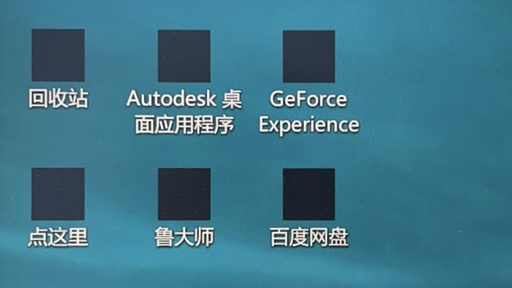
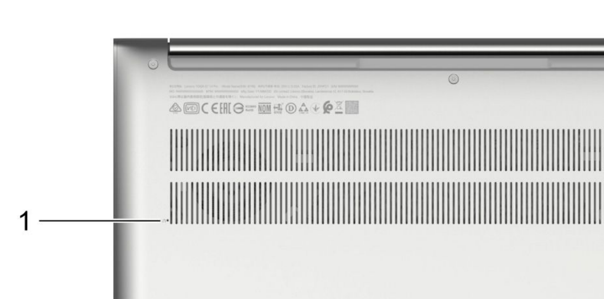

# PC服务队维修指南

[TOC]

## 常用操作

### <span id="show-hidden-files">显示系统级隐藏文件</span>

1. 从任务栏中打开**文件资源管理器**。 

2. 选择“**查看**”>“**选项**”>“**更改文件夹和搜索选项**”。

3. 选择“**查看**”选项卡，取消勾选“**隐藏受保护的操作系统文件**“，然后选择“**确定**”。

> 注意：请在完成相应操作后，重新勾选“**隐藏受保护的操作系统文件**“，以防误删系统文件。


### <span id="use-checker-to-repair-system-files">扫描系统文件的错误</span>

使用`CMD`或`Windows PowerShell`运行如下命令

```powershell
sfc /scannow
```

> 更多信息，参阅[使用系统文件检查器工具修复丢失或损坏的系统文件](https://support.microsoft.com/zh-cn/topic/使用系统文件检查器工具修复丢失或损坏的系统文件-79aa86cb-ca52-166a-92a3-966e85d4094e)


## 疑难杂症

### 桌面图标变黑

可能原因：图标缓存错误

解决方案：打开`C:\用户\当前用户名\Local\AppData`，将`IconCache.db`删除



> 如果无法找到AppData，请参阅[显示系统级隐藏文件](#show-hidden-files)
> 
> 如果仍无法修复，请参阅[扫描系统文件的错误](#use-checker-to-repair-system-files)


## 重装系统

### 通过官方救援系统重置

使用官方救援系统是重置系统最便捷、最快的方式，因其自带原厂驱动及软件，不需要联网安装，通常在20-30分钟即可回到桌面并正常使用。且如今电脑的部分功能需要依赖原厂软件实现，如华为的一碰传功能，故强烈推荐使用该方式重置系统。

#### 联想

##### 方式一

适用机型：部分2017年后购买的预装Win11/10的机型

进入方式：

1. 关机状态下，使用卡针按下电脑侧面^*^的`Novo`键，电脑将自动开机。

   

   *部分电脑的`Novo`键在散热口旁边，如下图所示：

   

2. 在菜单中选择**System Recovery**

3. 如果系统直接进入高级启动页面，请参阅[通过Windows 恢复环境 (Windows RE)重置](#WinRE)


##### 方式二

适用机型：ThinkPad

进入方式：启动时使用`Fn+F11`组合键或`F11`键进入。（如果键盘上有`ThinkVantage`键，则可使用该键进入）


#### 华为/荣耀

适用机型：除MateBook 一代（Hertz）均支持

进入方式：启动时使用`Fn+F10`组合键或`F10`键进入


#### DELL（戴尔）

适用机型：硬盘含有隐藏救援分区的机型（通常在几G～十几G）

进入方式：开机按 `F12` 访问一次性启动菜单。适用键盘方向键选择 **SupportAssist OS Recovery**，然后按 `Enter` 键。 

> 提醒：必须在系统 BIOS 中启用 **SupportAssist OS Recovery**。

> 提示：如果系统中没有**SupportAssist OS Recovery**，还可以使用官方恢复工具：https://www.dell.com/support/osrecovery
>


#### 华硕

##### 方式一：救援系统

适用机型：步骤二中含有**MyASUS in WinRE**选项的机型

进入方式：

1. 步骤一：
   a. 能正常进入桌面：设置-更新和安全-恢复-高级启动-立即重启
   b. 不能正常进入桌面：开机时按`F9` 或 `F12` ，进入高级启动页面

2. 步骤二：


​		疑难解答-**MyASUS in WinRE**（部分机型可能跳过高级启动，直接进入MyASUS in WinRE）

https://www.asus.com.cn/support/FAQ/1041621/#A4

##### 方式二：BIOS云端恢复

适用机型：

- 支持英特尔第十二代 12 th Gen Intel® Core™处理器(Alder lake)或更高版本（部分机型不支持云端还原功能）
- 支持AMD的锐龙 6000 处理器(Rembrandt)或更高版本（部分机型不支持云端还原功能）

进入方式：开机时按键盘上的 `ESC` 或 `F2` 键，会出现以下画面。按键盘上的箭头键，选择 **Enter Setup**，然后按键盘上的`Enter`键进入**MyASUS in UEFI BIOS**


#### acer（宏碁）

适用机型：硬盘含有隐藏救援分区的机型（通常在几G～十几G）

进入方式：

1. 开机按`F2`键进入BIOS界面，先选择**MAIN**选项，把**D2D Recovery**的选项设置为**Enabled**。按`F10`保存退出。
1. 开机时按住`Alt`键不放，快速按`F10`。
1. 如出现**Acer eRecovery**这个选项，按`Enter`键。


### <span id="WinRE">通过Windows 恢复环境 (Windows RE)重置</span>


### 使用PE环境重置

如果系统已经损坏，可以使用该方法重置

